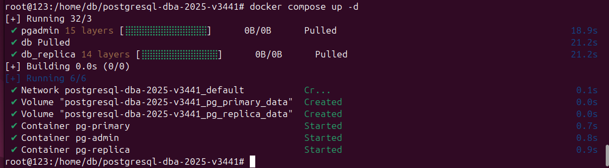
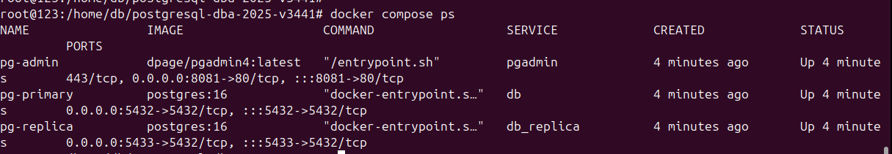

# 0) Установка PostgreSQL в контейнере

# 1) Клонирование репозитория курсовой работы
   Рисунок 0.1.2 Скрин склонированного репозитория

# 2) Запуск PostgreSQL сервера
   Рисунок 0.1.2 Скрин запущенного сервера

   Рисунок 0.1.3 Скрин проверки работы сервера
