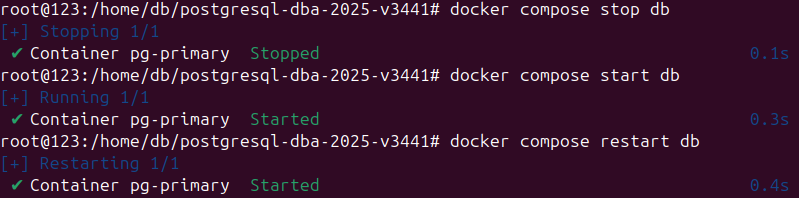
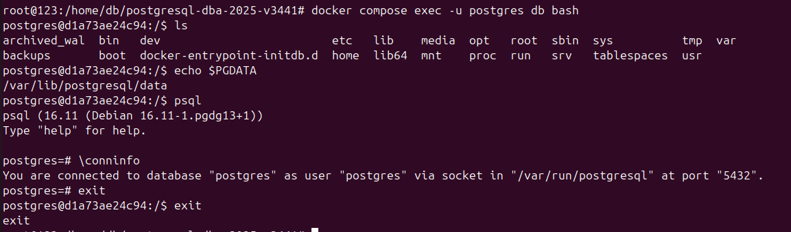
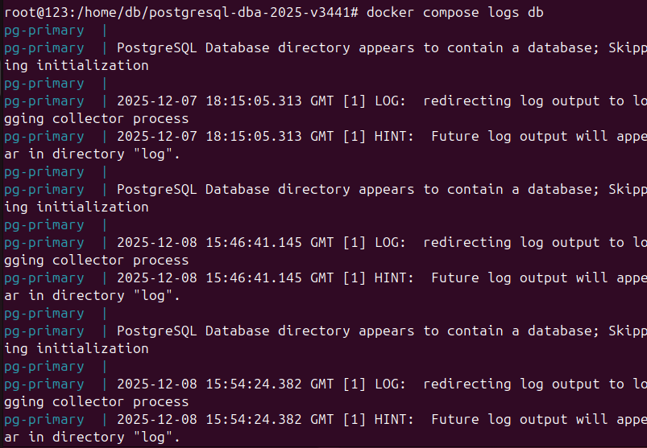

# 1) Управление сервером

1. Осуществите остановку/запуск/перезапуск сервера на уровне контейнера, не перезапуская pgAdmin
```bash
docker compose stop db
docker compose start db
docker compose restart db
```
2. Зайдите в командную строку контейнера (команда `docker compose exec -u postgres db bash`), 
    - выведите содержимое текущего каталога
    - выведите значение переменной окружения `PGDATA`
    - запустите утилиту psql и проверьте информацию о подключении
    - Вернитесь из командной строки контейнера в командную строку ОС
3. Просмотрите логи сервисов `db` и `pgadmin`
```bash
docker compose logs db
docker compose logs pgadmin
```

# Содержимое пояснительной записки


## 1) Осуществлёна остановка/запуск/перезапуск сервера на уровне контейнера, не перезапуская pgAdmin

Для запуска сервера на уровне контейнера выполняем в терминале команду `compose start db`

Для остановки сервера на уровне контейнера выполняем в терминале команду `compose stop db`

Для перезапуска сервера на уровне контейнера выполняем в терминале команду `compose restart db`
 <br> Рисунок 1.1 - остановка/запуск/перезапуск сервера на уровне контейнера, не перезапуская pgAdmin

## 2) Вывод служебной информации

Для входа в контейнер выполняем команду `docker compose exec -u postgres db bash`

Для вывода содержимого каталога выполняем команду `ls`

Для вывода значения переменной окружения `PGDATA` выполняем команду `echo @PGDATA`

Для запуска утилиты psql и проверке информацию о подключении
в консоли выполняем команду `psql` и в консоли клиента выполняем команду `\conninfo`

Для возврата из командной строки контейнера в командную строку ОС выполняем команду `exit`


 <br> Рисунок 1.1 - вывод информации

## 3) Просмотр логи сервисов `db` и `pgadmin`

Для просмотра логов сервисов `db` и `pgadmin` выполняем команды
```bash
docker compose logs db
docker compose logs pgadmin
```
<br> Рисунок 1.3  Вывод логов служб
