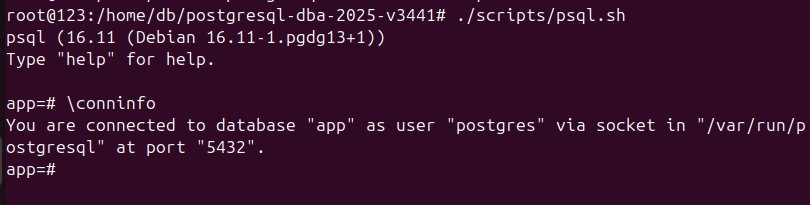
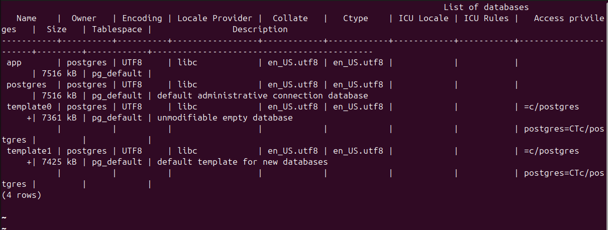
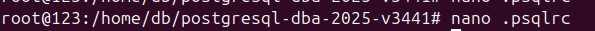
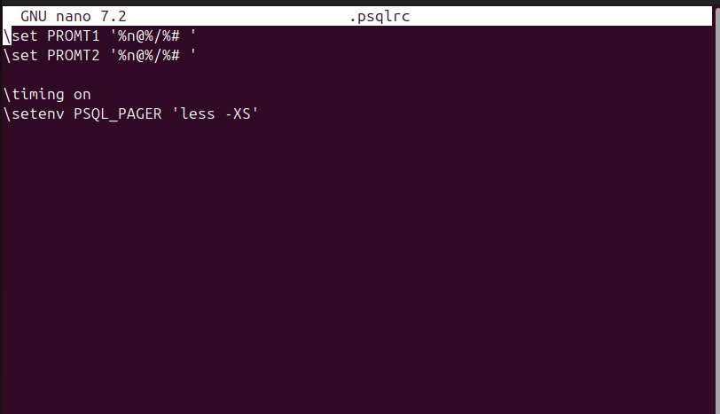
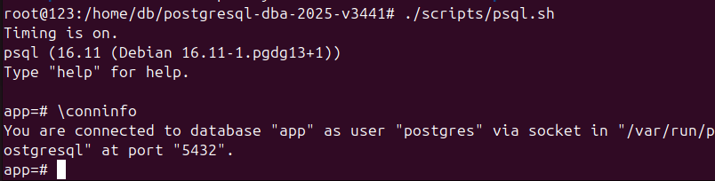
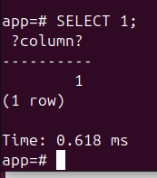
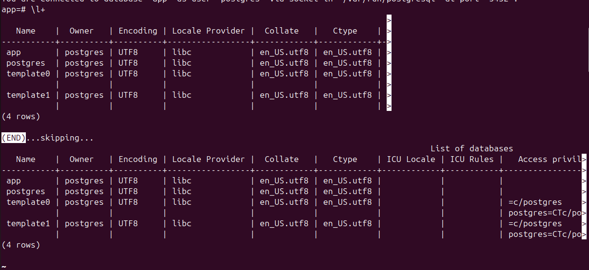

# 2) Использование psql
## 1) Подключение к серверу и проверка информации

Выполнено подключение с помощью вспомогательного скрипта (./scripts/psql.sh), проверена информация с помощью команды \conninfo.

 <br> Рисунок 2.1. Подключение к серверу и проверка информации через команду \conninfo.
## 2) Список баз данных

Выведен список баз данных с помощью /l+

 <br> Рисунок 2.2. Список существующих баз данных
## 3) Создание файла .psqlrc
В корне репозитория был создан файл '.psqlrc' со следующим содержимым:

```text
\set PROMPT1 '%n@%/%# '
\set PROMPT2 '%n@%/%# '

\timing on
\setenv PSQL_PAGER 'less -XS'
```

- Настроен вид приглашения вида пользователь@база=# с помощью переменных pqsl PROMPT1 и PROMPT2;
- Настроен вывод длительности команд в psql с помощью \timing on;
- Настроен pager less -XS с помощью переменной окружения PSQL_PAGER.
  
 <br> Рисунок 2.3. Создание файла .psqlrc с помощью nano
 <br> Рисунок 2.4. Содержимое файла .psqlrc
## 4) Повторное подключение и \conninfo
После сохранения '.psqlrc' подключение к серверу через скрипт (./scripts/psql.sh) и проверка информации с помощью команды \conninfo были запущены повторно.

Приглашение psql сменилось на 'user@db=#', а в \conninfo указано, что параметры остались прежними.
 <br> Рисунок 2.5. Вывод информации \conninfo
## 5) Проверка работы \timing
Для проверки \timing был выполнен запрос 'SELECT 1'.

В результате выполнения данного запроса появилась строка вида Time: 0.618 ms, что подтверждает успешное применение настройки \timing on.

 <br> Рисунок 2.6. Вывод информации после работы \timing on

## 6) Вывод списка баз данных

Повторно была выполнена команда \l+. Список баз стал отображаться через pager less, сохраняется формат user@db=#

 <br> Рисунок 2.7. Вывод информации о базах данных
