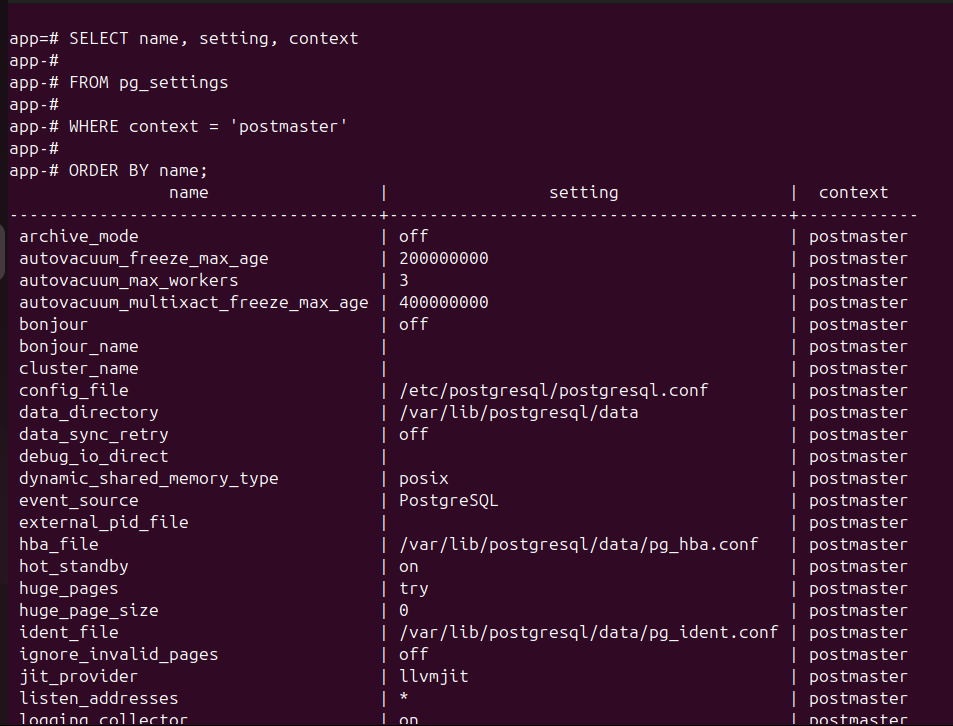
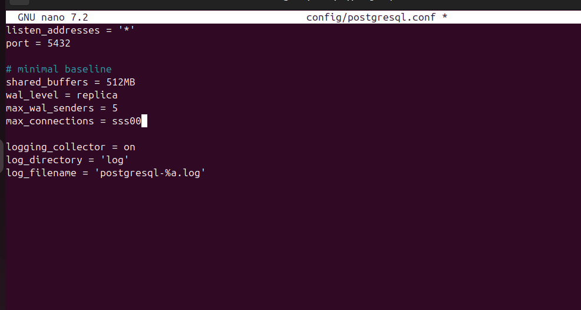
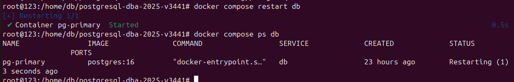
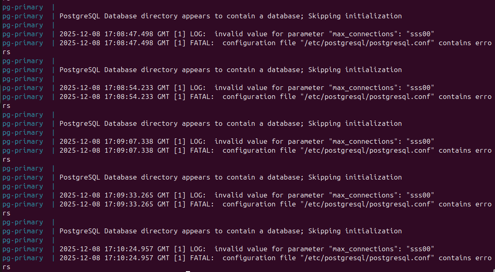
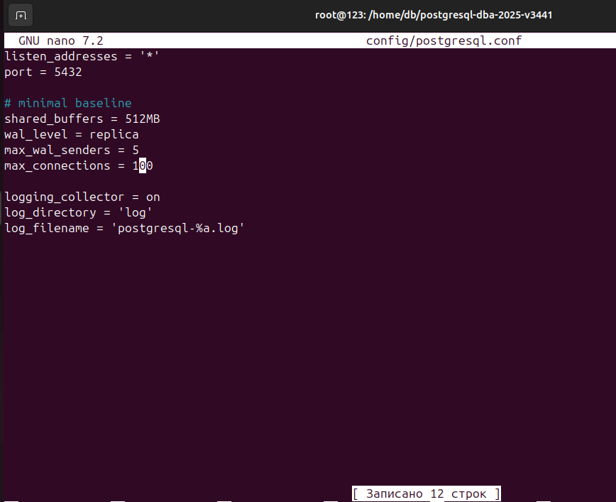
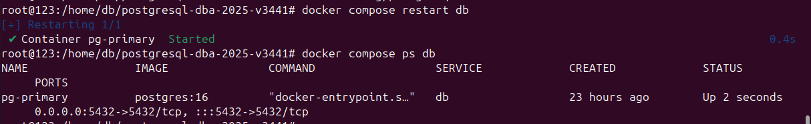
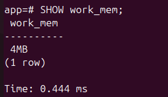
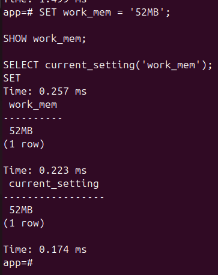
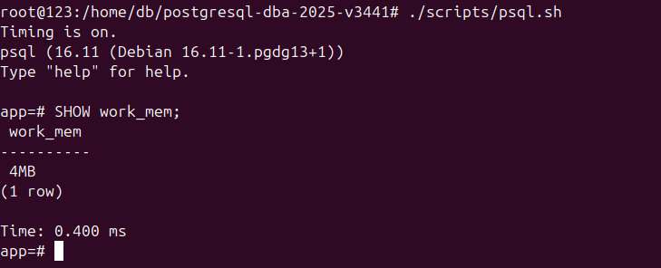

# 3) Конфигурирование сервера
##  1) Список параметров через запрос к представлению 'pg_settings' с условием context = 'postmaster'

В psql был выполнен запрос к представлению 'pg_settings':

```sql
SELECT name, setting, context
FROM pg_settings
WHERE context = 'postmaster'
ORDER BY name;
```

Результат показывает параметры конфигурации, у которых context равен `postmaster`.

 <br> Рисунок 3.1. Выполнение запроса к представлению 'pg_settings' и получение списка параметров конфигурации.

## 2) Ошибка в файле 'config/postgresql.conf'

В файле 'config/postgresql.conf' в блоке 'minimal baseline' допущена синтаксическая ошибка при изменении 'max_connections'.

 <br> Рисунок 3.2. Синтаксическая ошибка в 'max_connections' в файле 'config/postgresql.conf'.
После изменения файла был выполнен перезапуск контейнера

```bash
docker compose restart db
docker compose ps db
```

 <br> Рисунок 3.3. Перезапуск контейнера.

На скриншоте видно, что 'pg-primary' находится в состоянии 'Restarting', то есть сервер не может корректно запуститься из-за синтаксической ошибки в файле, допущенной раннее.


## 3) Логи сервера с синтаксической ошибкой в 'max_connections'

Были открыты логи сервиса db с помощью команды docker compose logs db.

По логам видно, что некорректное значение параметра 'max_connections' мешает запуску.

 <br> Рисунок 3.4. Логи контейнера с ошибкой.
## 4) Исправление конфигурации и успешный запуск сервера

В 'config/postgresql.conf' в параметре 'max_connections' была исправлена синтакическая ошибка.

 <br> Рисунок 3.5. Исправление синтаксической ошибки в параметре 'max_connections'.

После этого снова выполнен перезапуск контейнера:

 <br> Рисунок 3.6. Перезапуск контейнера.

Теперь 'pg-primary' находятся в состоянии 'Up', что означает успешный запуск после исправления синтаксической ошибки.
## 5) Проверка параметра 'work_mem' до изменения
Установлен параметр 'work_mem' для текущего сеанса psql:

 <br> Рисунок 3.7. Установка параметра 'work_mem' для текущего сеанса.

На скриншоте видно, что исходное значение параметра равно 4 МБ.
## 6) Изменение work_mem

В том же сеансе psql параметр был изменён командой:

```sql
SET work_mem = '52MB';
SHOW work_mem;
SELECT current_setting('work_mem');
```

После выполнения запроса значение 'work_mem' стало равным 52 МБ, при этом изменение действует только внутри текущего сеанса.

 <br> Рисунок 3.8. Изменение параметра 'work_mem' в текущем сеансе psql.

## 7) Проверка 'work_mem' после нового подключения

Прошлый сеанс был завершён командой \q. В новом сеансе команда показала исходное значение параметра в 4 МБ. Это подтверждает, что изменение через SET work_mem = '64MB' не сохраняется после выхода из сеанса psql.

 <br> Рисунок 3.9. Проверка параметра 'work_mem' после запуска нового сеанса psql.

